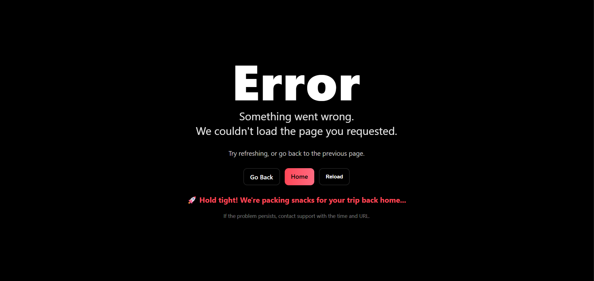
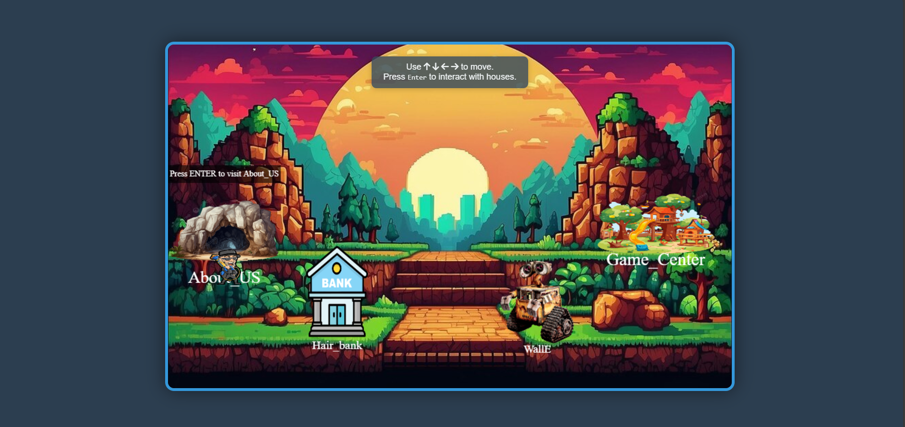

# Play ‘n’ Pluck🎯

## Basic Details
### Team Name: IdeaNotFound

### Team Members

- Member 1: Havana A
- Member 2: Sreedeep Pradeep

### Project Description
its a fun and feel good web for you to find happines.
**check out the link**https://havana-15092006.github.io/play-n-Pluck/

## Technical Details
### Technologies/Components Used
For Software:
- gemini ai
- chat gpt 
- lovable.dev
- gemini api

### Implementation
For Software:
- html 
- css
- python
-java-Script

# ProjectDemo
# Vedios

### Project Documentation
For Software:

# Screenshots (Add at least 3)

 

Made with ❤️ at TinkerHub Useless Projects 

